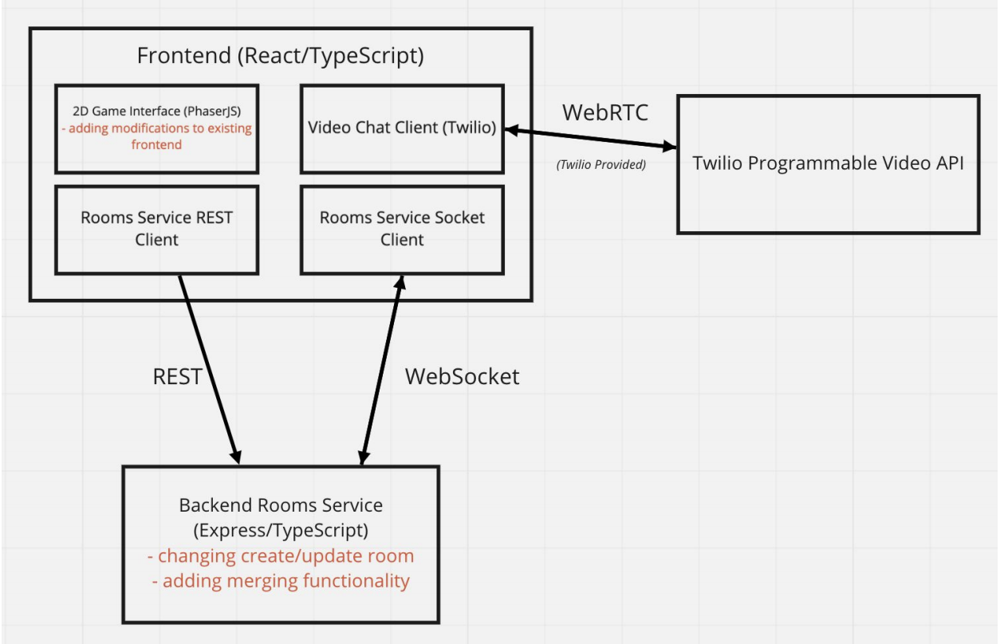

# Merging Feature

## Backend

- Added a isMergeable property to the town which is set on town creation, users can designate their town as mergeable or not  mergeable when they create the new town, default set to true
- Added isJoinable property to town which indicates whether the town is currently merging and can't be merged with or if it is free to merge with, default is true
- Created a TownMergeRequest in the TownServiceClient to provide a structure for the payload sent by the client to merge two towns
- Created mergeTowns method in TownServiceClient to pass the TownMergeRequest data to the town merge api endpoint
- Created listMergeableTowns method in TownServiceClient to return a list of available mergeable towns to populate the mergeable towns list shown to the users
- Created townsMerged method in CoveyRoomController to notify all players that they are being merged into a new town
- Created getMergeableTowns method in CoveyTownsStore to return a list of all the available mergeable towns
- Created mergeTowns method in CoveyTownsStore which disconnects all players from the two towns that are merging, deletes those towns, and connect all towns to the new town
- Created townMergeableListHandler method in CoveyTownRequestHandlers that returns that list of mergeable towns
- Created townMergeRequestHandler method in CoveyTownRequestHandlers that merges the towns if the request is valid and returns an error message if there will be a capacity overflow in the new room, the password is incorrect, the new friendlyName is empty, or one of the towns is already involved in a merge
- Added a patch http method to handle merging towns
- Added a get http method to list the available mergeable towns
- Added an onTownMerged method in the CoveyTownListener to be called when a player requests that their town be merged with another town

## Frontend

- Created a TownMerging class in the frontend/src/components/Login to create the modal that pops up when a player clicks the town merge button, this modal handles selecting the town to merge with as well as setting the new town settings
- Added isMergeable checkbox to town creation modal
